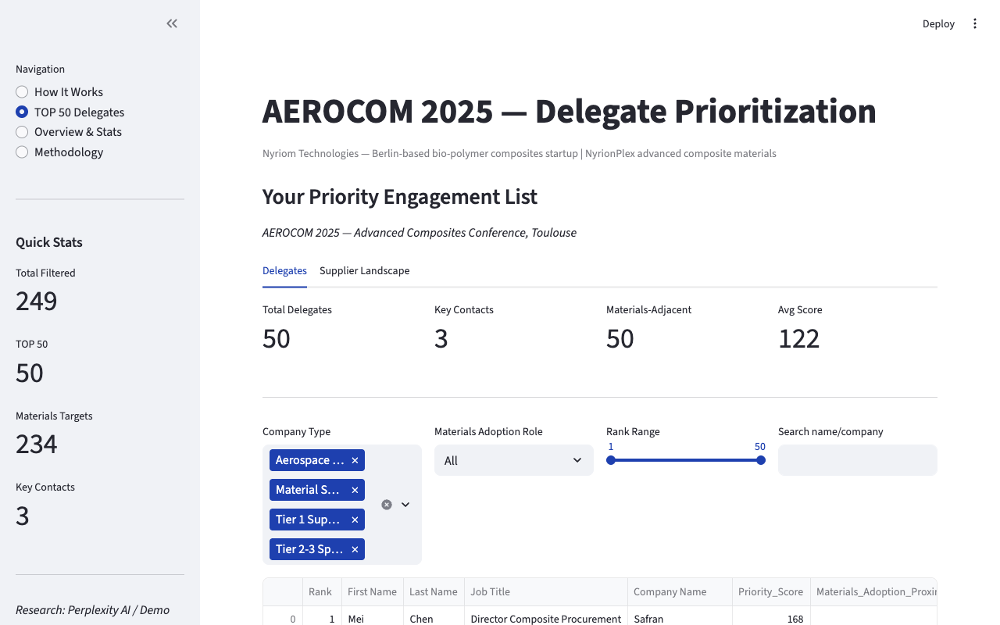

# AEROCOM 2025 — AI-Powered Conference Lead Prioritization

You're attending an aerospace composites conference with 500+ delegates. You have two days. Who do you talk to?

## The Problem

Sales teams at niche B2B startups face a common challenge at large conferences: hundreds of attendees, limited time, and no systematic way to identify who actually influences purchasing decisions in their domain. A VP of Materials at Airbus is worth more than an hour of small talk with a trade journalist — but how do you find them before the event starts?

## The Result

This pipeline takes a raw conference guest list and produces a ranked TOP 50 engagement list — scored by job seniority, company relevance, proximity to material selection decisions, and AI-researched signals like active lightweighting programs and R&D budgets.

[](https://nyriom-list.streamlit.app)

> **[Try the live demo](https://nyriom-list.streamlit.app)** — interactive dashboard, no setup required

### Sample output (Top 3)

| Rank | Name | Company | Score | Title |
|------|------|---------|-------|-------|
| 1 | Mei Chen | Safran | 168 | Director Composite Procurement |
| 2 | Jan Weber | Hexcel Corporation | 150 | Head of Sustainable Materials |
| 3 | Erik Lindstrom | Airbus | 147 | VP Materials & Processes |

## How It Works

```
522 delegates          Filter by company        AI researches each       Deep research on         Final ranked
(raw guest list)  -->  type + job role     -->  person (13 variables) -->  top 60 candidates  -->  TOP 50 list
                       = 249 relevant                                                              + dashboard
```

1. **Filter** — Sort delegates by company type (OEM, supplier, material company) and job function. Remove anyone from companies that don't buy materials — law firms, media, universities — and junior roles like interns or assistants.

2. **Research** — For each remaining person, AI looks up their company's programs, whether they influence material selection, who their current suppliers are, their R&D budget, and sustainability initiatives.

3. **Score** — Each person gets a priority score based on job seniority, company relevance, how close they are to material purchasing decisions, and what the research found.

4. **Enhance + Rank** — The top 60 get a second, deeper research pass to fill data gaps. Everyone is re-scored and the final TOP 50 becomes your engagement list.

## What the AI Researches

| Category | What it looks for |
|----------|------------------|
| **Company profile** | Type (OEM, tier supplier, material company), programs, scale, geography |
| **Purchasing signals** | Material selection authority, current suppliers, specification influence |
| **Growth signals** | Lightweighting programs, R&D budget, recent acquisitions |
| **Sustainability** | Green manufacturing initiatives, bio-materials interest |

## Tech Stack

Python, Streamlit, Perplexity Sonar API, Pandas, Plotly

<details>
<summary><strong>Running it yourself</strong></summary>

### Demo mode (no API key, instant, free)

```bash
git clone https://github.com/lorenzo-leprotti/nyriom-list.git
cd nyriom-list
python -m venv venv && source venv/bin/activate
pip install -r requirements.txt

python step1_buckets.py
python step2_research.py --backend demo
python step3_score.py
python step4_enhance.py --backend demo
python step5_final_rank.py

streamlit run dashboard.py
```

### Perplexity mode (production — ~$1.85 total, ~27min)

```bash
cp .env.example .env
# Add your Perplexity API key to .env

python step2_research.py --backend perplexity --test 5   # Test first
python step2_research.py --backend perplexity             # Full run
python step4_enhance.py --backend perplexity              # Enhancement
```

### Project structure

```
nyriom_config.py          ← Scoring rules, buckets, thresholds
research_backends.py      ← Backend abstraction (Perplexity / Demo)
step1_buckets.py          ← Categorize + filter
step2_research.py         ← AI research (13 variables per delegate)
step3_score.py            ← Multi-factor scoring engine
step4_enhance.py          ← Deep research on top prospects
step5_final_rank.py       ← Final ranking + Excel export
dashboard.py              ← Streamlit dashboard
```

</details>

## Related Projects

| Project | Description |
|---------|-------------|
| [Nyriom Intelligence](https://github.com/lorenzo-leprotti/nyriom-intelligence) | AI market intelligence platform |
| [nyriom-dashboard](https://github.com/lorenzo-leprotti/nyriom-dashboard) | Sustainability impact simulator |

## Disclosure

This is a portfolio demonstration project. **AEROCOM 2025** is a fictional aerospace composites conference. Company names (Airbus, Hexcel, Safran, etc.) are real industry participants; individual delegate names are generated. The pipeline architecture, scoring logic, and code are production-representative.
